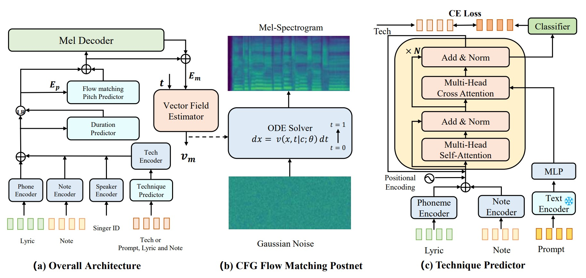

{:.no_toc}
* toc
{:toc}

# Abstract

Singing voice synthesis has achieved remarkable progress in generating natural and high-quality voices. However, existing methods rarely provide precise control over vocal techniques such as mixed voice, falsetto, and breathy tones, limiting the expressive potential of synthetic voices. To address this, we introduce TechSinger, an advanced system for controllable singing voice synthesis that supports five languages and seven vocal techniques. TechSinger employs a flow-matching-based model to accurately reproduce these techniques. To enhance the diversity of training data, we develop a technique detection model that annotates datasets with phoneme-level technique labels. Additionally, our prompt-based technique prediction model enables users to specify desired vocal attributes through natural language, offering fine-grained control over the synthesized singing. Experimental results demonstrate that TechSinger significantly enhances the expressiveness and realism of synthetic singing voices, outperforming existing methods in terms of audio quality and technique-specific control.

<!-- ---

**Note：** We conduct all tasks in the zero-shot scenario, with training and testing on cross-lingual speech and singing data. 

---

**Dataset**: https://huggingface.co/datasets/GTSinger/GTSinger. For the dataset, we have included a portion of the dataset in the data attachment submitted with the paper. The complete version will be released once the paper is accepted. 

--- -->

# Technique-Controllable Singing Voice Synthesis(SVS)

To assess the performance of TechSinger and baseline models in the technique-controllable singing voice task, we randomly select samples with unseen singers from the test set as targets via different controlling strategies. And in order to represent singing techniques more simply, we use the technique id shown below.

**Technique ID**: 0-No Technique; 1-Mixed Voice; 2-Falsetto; 3-Breathy; 4-Pharyngeal; 5-Vibrato; 6-Glissando; 7-Bubble; 8-Strong; 9-Weak.
                       
## GT

GT represents the technique controlling strategies that the techniques are obtained from the annotated technique sequences.

**Word:** 抓 不 住 爱 情 的 我 &lt;AP&gt; 总 是 眼 睁 睁 看 它 溜 走

**Phoneme with Technique:** zh(1) ua(1) b(1) u(1) zh(1) u(1) ai(1) q(1) ing(1) d(1) e(1) uo(1) &lt;AP&gt; z(1) ong(1) sh(1) i(1) ian(2) zh(2) eng(2) zh(2) eng(2) k(1) an(1) t(1) a(1) l(1) iou(1,6) z(1) ou(1)

<table style='width: 40%;'>
	<thead>
		<tr>
			<th style='text-align: center'>Ground Truth</th>
		</tr>
	</thead>
	<tbody>
		<tr>
			<td style='text-align: center'><audio controls style='width: 150px;'><source src='wavs/svs/gt/gt/0000.wav' type='audio/wav'></audio></td>
		</tr>
	</tbody>
</table>

<table style='width: 100%;'>
	<thead>
		<tr>
			<th style='text-align: center'>DiffSinger</th>
			<th style='text-align: center'>Visinger2</th>
			<th style='text-align: center'>StyleSinger</th>
			<th style='text-align: center'>TechSinger(Ours)</th>
		</tr>
	</thead>
	<tbody>
		<tr>
				<td style='text-align: center'><audio controls style='width: 150px;'><source src='wavs/svs/gt/diffsinger/0000.wav' type='audio/wav'></audio></td>
				<td style='text-align: center'><audio controls style='width: 150px;'><source src='wavs/svs/gt/visinger/0000.wav' type='audio/wav'></audio></td>
				<td style='text-align: center'><audio controls style='width: 150px;'><source src='wavs/svs/gt/stylesinger/0000.wav' type='audio/wav'></audio></td>
				<td style='text-align: center'><audio controls style='width: 150px;'><source src='wavs/svs/gt/techsinger/0000.wav' type='audio/wav'></audio></td>
		</tr>
	</tbody>
</table>

***

**Word:**  想 你 时 你 在 脑 海

**Phoneme with Technique:** x(0) iang(0) n(0) i(0) sh(0) i(0) n(0) i(6) z(0) ai(0) n(0) ao(6) h(0) ai(0)

<table style='width: 40%;'>
	<thead>
		<tr>
			<th style='text-align: center'>Ground Truth</th>
		</tr>
	</thead>
	<tbody>
		<tr>
			<td style='text-align: center'><audio controls style='width: 150px;'><source src='wavs/svs/gt/gt/0001.wav' type='audio/wav'></audio></td>
		</tr>
	</tbody>
</table>

<table style='width: 100%;'>
	<thead>
		<tr>
			<th style='text-align: center'>DiffSinger</th>
			<th style='text-align: center'>Visinger2</th>
			<th style='text-align: center'>StyleSinger</th>
			<th style='text-align: center'>TechSinger(Ours)</th>
		</tr>
	</thead>
	<tbody>
		<tr>
				<td style='text-align: center'><audio controls style='width: 150px;'><source src='wavs/svs/gt/diffsinger/0001.wav' type='audio/wav'></audio></td>
				<td style='text-align: center'><audio controls style='width: 150px;'><source src='wavs/svs/gt/visinger/0001.wav' type='audio/wav'></audio></td>
				<td style='text-align: center'><audio controls style='width: 150px;'><source src='wavs/svs/gt/stylesinger/0001.wav' type='audio/wav'></audio></td>
				<td style='text-align: center'><audio controls style='width: 150px;'><source src='wavs/svs/gt/techsinger/0001.wav' type='audio/wav'></audio></td>
		</tr>
	</tbody>
</table>

***

**Word:**  一 次 就 好 &lt;AP&gt; 我 带 你 去 看 天 荒 地 老

**Phoneme with Technique:** i(1,6) c(1) i(1) j(1) iou(1) h(1) ao(1) &lt;AP&gt; uo(1) d(1) ai(1) n(1) i(1) q(1) u(1) k(1) an(1) t(2,6) ian(2) h(2,6) uang(2) d(2) i(2) l(2,6) ao(2,6)

<table style='width: 40%;'>
	<thead>
		<tr>
			<th style='text-align: center'>Ground Truth</th>
		</tr>
	</thead>
	<tbody>
		<tr>
			<td style='text-align: center'><audio controls style='width: 150px;'><source src='wavs/svs/gt/gt/0002.wav' type='audio/wav'></audio></td>
		</tr>
	</tbody>
</table>

<table style='width: 100%;'>
	<thead>
		<tr>
			<th style='text-align: center'>DiffSinger</th>
			<th style='text-align: center'>Visinger2</th>
			<th style='text-align: center'>StyleSinger</th>
			<th style='text-align: center'>TechSinger(Ours)</th>
		</tr>
	</thead>
	<tbody>
		<tr>
				<td style='text-align: center'><audio controls style='width: 150px;'><source src='wavs/svs/gt/diffsinger/0002.wav' type='audio/wav'></audio></td>
				<td style='text-align: center'><audio controls style='width: 150px;'><source src='wavs/svs/gt/visinger/0002.wav' type='audio/wav'></audio></td>
				<td style='text-align: center'><audio controls style='width: 150px;'><source src='wavs/svs/gt/stylesinger/0002.wav' type='audio/wav'></audio></td>
				<td style='text-align: center'><audio controls style='width: 150px;'><source src='wavs/svs/gt/techsinger/0002.wav' type='audio/wav'></audio></td>
		</tr>
	</tbody>
</table>

***

**Word:** love your curves and all your edges &lt;AP&gt; all your perfect imperfections.

**Phoneme with Technique:** L(1) AH1(1) V(1) Y(1) UH1(1) R(1) K(1) ER1(1) V(1) Z(1) AE1(1) N(1) D(1) AA1(1) L(1) Y(1) UH1(1) R(1) EH1(1) JH(1) IH0(1) Z(1) &lt;AP&gt;(0) AA1(1) L(1) Y(1,6) AO1(1,6) AO1(1,6) R(1,6) P(1) ER1(1) F(1) IH2(1) K(1) T(1) IH2(1) M(1) P(1) ER0(1) F(1) EH1(1) K(1) SH(1) AH0(1) N(1) Z(1) 

<table style='width: 40%;'>
	<thead>
		<tr>
			<th style='text-align: center'>Ground Truth</th>
		</tr>
	</thead>
	<tbody>
		<tr>
			<td style='text-align: center'><audio controls style='width: 150px;'><source src='wavs/svs/gt/gt/0003.wav' type='audio/wav'></audio></td>
		</tr>
	</tbody>
</table>

<table style='width: 100%;'>
	<thead>
		<tr>
			<th style='text-align: center'>DiffSinger</th>
			<th style='text-align: center'>Visinger2</th>
			<th style='text-align: center'>StyleSinger</th>
			<th style='text-align: center'>TechSinger(Ours)</th>
		</tr>
	</thead>
	<tbody>
		<tr>
				<td style='text-align: center'><audio controls style='width: 150px;'><source src='wavs/svs/gt/diffsinger/0003.wav' type='audio/wav'></audio></td>
				<td style='text-align: center'><audio controls style='width: 150px;'><source src='wavs/svs/gt/visinger/0003.wav' type='audio/wav'></audio></td>
				<td style='text-align: center'><audio controls style='width: 150px;'><source src='wavs/svs/gt/stylesinger/0003.wav' type='audio/wav'></audio></td>
				<td style='text-align: center'><audio controls style='width: 150px;'><source src='wavs/svs/gt/techsinger/0003.wav' type='audio/wav'></audio></td>
		</tr>
	</tbody>
</table>

***

**Word:** du printemps &lt;AP&gt;

**Phoneme with Technique:** d(5) y(5) p(5) ʁ(5) ɛ̃(5) t(5) ɑ̃(5) &lt;AP>&gt;(0)

<table style='width: 40%;'>
	<thead>
		<tr>
			<th style='text-align: center'>Ground Truth</th>
		</tr>
	</thead>
	<tbody>
		<tr>
			<td style='text-align: center'><audio controls style='width: 150px;'><source src='wavs/svs/gt/gt/0004.wav' type='audio/wav'></audio></td>
		</tr>
	</tbody>
</table>

<table style='width: 100%;'>
	<thead>
		<tr>
			<th style='text-align: center'>DiffSinger</th>
			<th style='text-align: center'>Visinger2</th>
			<th style='text-align: center'>StyleSinger</th>
			<th style='text-align: center'>TechSinger(Ours)</th>
		</tr>
	</thead>
	<tbody>
		<tr>
				<td style='text-align: center'><audio controls style='width: 150px;'><source src='wavs/svs/gt/diffsinger/0004.wav' type='audio/wav'></audio></td>
				<td style='text-align: center'><audio controls style='width: 150px;'><source src='wavs/svs/gt/visinger/0004.wav' type='audio/wav'></audio></td>
				<td style='text-align: center'><audio controls style='width: 150px;'><source src='wavs/svs/gt/stylesinger/0004.wav' type='audio/wav'></audio></td>
				<td style='text-align: center'><audio controls style='width: 150px;'><source src='wavs/svs/gt/techsinger/0004.wav' type='audio/wav'></audio></td>
		</tr>
	</tbody>
</table>

**Word:** que frescura la noche trae &lt;AP&gt; cuando cae sol 

**Phoneme with Technique:** c(0) e(0) f(0) ɾ(0) e(0) s(0) k(0) u(0) ɾ(0) a(0) l(0) a(0) n(0) o(6) tʃ(0) e(6) t(0) ɾ(0) a(0) e(0) &lt;AP&gt;(0) k(1) w(1) a(1) n(1) d(1) o(1) k(1,3) a(1,3) e(1,3) s(1,3) o(1,3) l(1,3)

<table style='width: 40%;'>
	<thead>
		<tr>
			<th style='text-align: center'>Ground Truth</th>
		</tr>
	</thead>
	<tbody>
		<tr>
			<td style='text-align: center'><audio controls style='width: 150px;'><source src='wavs/svs/gt/gt/0005.wav' type='audio/wav'></audio></td>
		</tr>
	</tbody>
</table>

<table style='width: 100%;'>
	<thead>
		<tr>
			<th style='text-align: center'>DiffSinger</th>
			<th style='text-align: center'>Visinger2</th>
			<th style='text-align: center'>StyleSinger</th>
			<th style='text-align: center'>TechSinger(Ours)</th>
		</tr>
	</thead>
	<tbody>
		<tr>
				<td style='text-align: center'><audio controls style='width: 150px;'><source src='wavs/svs/gt/diffsinger/0005.wav' type='audio/wav'></audio></td>
				<td style='text-align: center'><audio controls style='width: 150px;'><source src='wavs/svs/gt/visinger/0005.wav' type='audio/wav'></audio></td>
				<td style='text-align: center'><audio controls style='width: 150px;'><source src='wavs/svs/gt/stylesinger/0005.wav' type='audio/wav'></audio></td>
				<td style='text-align: center'><audio controls style='width: 150px;'><source src='wavs/svs/gt/techsinger/0005.wav' type='audio/wav'></audio></td>
		</tr>
	</tbody>
</table>

***

## Random

Random represents the technique controlling strategies that the model generates the techniques automatically and randomly.

**Word:** 我 知 道 &lt;AP&gt; 那 些 夏 天 &lt;AP&gt; 就 像 青 春 一 样 回 不 来

**Generated Technique Sequence:** uo(1,7) zh(1) i(1) d(1) ao(1) &lt;AP&gt; n(7) a(7) x(1) ie(1) x(1,3) ia(1,3) t(1,3) ian(1,3) &lt;AP&gt; j(1,7) iou(1,7) x(1) iang(1) q(8) ing(8) ch(8) un(8) i(1,3) iang(1,3) h(1,9) ui(1,9) b(1,9) u(1,9) l(1,9) ai(1,9)

<table style='width: 100%;'>
	<thead>
		<tr>
			<th style='text-align: center'>DiffSinger</th>
			<th style='text-align: center'>Visinger2</th>
			<th style='text-align: center'>StyleSinger</th>
			<th style='text-align: center'>TechSinger(Ours)</th>
		</tr>
	</thead>
	<tbody>
		<tr>
				<td style='text-align: center'><audio controls style='width: 150px;'><source src='wavs/svs/random/diffsinger/0000.wav' type='audio/wav'></audio></td>
				<td style='text-align: center'><audio controls style='width: 150px;'><source src='wavs/svs/random/visinger/0000.wav' type='audio/wav'></audio></td>
				<td style='text-align: center'><audio controls style='width: 150px;'><source src='wavs/svs/random/Stylesinger/0000.wav' type='audio/wav'></audio></td>
				<td style='text-align: center'><audio controls style='width: 150px;'><source src='wavs/svs/random/techsinger/0000.wav' type='audio/wav'></audio></td>
		</tr>
	</tbody>
</table>

***

**Word:** 离 别 没 说 再 见 &lt;AP&gt; 你 是 否 心 酸

**Generated Technique Sequence:** l(1,3) i(1,3) b(1,3) ie(1,3) m(1) ei(1) sh(1) uo(1) z(0) ai(0) j(0) ian(5) &lt;AP&gt;(0) n(0) i(0) sh(1) i(1) f(1) ou(1) x(1) in(1,5) s(1) uan(1,5)

<table style='width: 100%;'>
	<thead>
		<tr>
			<th style='text-align: center'>DiffSinger</th>
			<th style='text-align: center'>Visinger2</th>
			<th style='text-align: center'>StyleSinger</th>
			<th style='text-align: center'>TechSinger(Ours)</th>
		</tr>
	</thead>
	<tbody>
		<tr>
				<td style='text-align: center'><audio controls style='width: 150px;'><source src='wavs/svs/random/diffsinger/0001.wav' type='audio/wav'></audio></td>
				<td style='text-align: center'><audio controls style='width: 150px;'><source src='wavs/svs/random/visinger/0001.wav' type='audio/wav'></audio></td>
				<td style='text-align: center'><audio controls style='width: 150px;'><source src='wavs/svs/random/Stylesinger/0001.wav' type='audio/wav'></audio></td>
				<td style='text-align: center'><audio controls style='width: 150px;'><source src='wavs/svs/random/techsinger/0001.wav' type='audio/wav'></audio></td>
		</tr>
	</tbody>
</table>

***

**Word:** &lt;SP&gt; edelweiß &lt;AP&gt; edelweiß &lt;AP&gt;

**Generated Technique Sequence:** &lt;SP&gt;(0) eː(4) d(4) ɛ(4) l(4) v(4) a(4) ɪ(4) s(0) &lt;AP&gt;(0) eː(1,6) d(1,6) ɛ(4,6) ɛ(4,6) l(4,6) v(4,6) a(4,6) ɪ(4,6) s(0) &lt;AP&gt;(0)

<table style='width: 100%;'>
	<thead>
		<tr>
			<th style='text-align: center'>DiffSinger</th>
			<th style='text-align: center'>Visinger2</th>
			<th style='text-align: center'>StyleSinger</th>
			<th style='text-align: center'>TechSinger(Ours)</th>
		</tr>
	</thead>
	<tbody>
		<tr>
				<td style='text-align: center'><audio controls style='width: 150px;'><source src='wavs/svs/random/Stylesinger/0002.wav' type='audio/wav'></audio></td>
				<td style='text-align: center'><audio controls style='width: 150px;'><source src='wavs/svs/random/visinger/0002.wav' type='audio/wav'></audio></td>
				<td style='text-align: center'><audio controls style='width: 150px;'><source src='wavs/svs/random/diffsinger/0002.wav' type='audio/wav'></audio></td>
				<td style='text-align: center'><audio controls style='width: 150px;'><source src='wavs/svs/random/techsinger/0002.wav' type='audio/wav'></audio></td>
		</tr>
	</tbody>
</table>

***

## Prompt-Guided

Prompt-Guided represents the technique controlling strategies that the techniques are predicted by our predictor based on the given prompts.

**Word:** 就 在 那 里 曾 是 你 和 我 &lt;AP&gt; 爱 过 的 地 方

**Prompt:** Generate a Chinese song where a female singer sings in medium vocal range using breathy technique. 

**Predicted Technique Sequence:** j(3) iou(3) z(3) ai(3) n(3) a(3) l(3) i(3) c(3) eng(3) sh(3) i(3) n(3) i(3) h(3) e(3) uo(3) &lt;AP&gt;(0) ai(3) g(3) uo(3) d(3) e(3) d(3) i(3) f(3) ang(3)

<table style='width: 100%;'>
	<thead>
		<tr>
			<th style='text-align: center'>DiffSinger</th>
			<th style='text-align: center'>Visinger2</th>
			<th style='text-align: center'>StyleSinger</th>
			<th style='text-align: center'>TechSinger(Ours)</th>
		</tr>
	</thead>
	<tbody>
		<tr>
				<td style='text-align: center'><audio controls style='width: 150px;'><source src='wavs/svs/prompt/diffsinger/0001.wav' type='audio/wav'></audio></td>
				<td style='text-align: center'><audio controls style='width: 150px;'><source src='wavs/svs/prompt/visinger/0001.wav' type='audio/wav'></audio></td>
				<td style='text-align: center'><audio controls style='width: 150px;'><source src='wavs/svs/prompt/Stylesinger/0001.wav' type='audio/wav'></audio></td>
				<td style='text-align: center'><audio controls style='width: 150px;'><source src='wavs/svs/prompt/techsinger/0001.wav' type='audio/wav'></audio></td>
		</tr>
	</tbody>
</table>

***

**Word:** 一 壶 清 酒 一 身 尘 灰

**Prompt:** Generate a Chinese pop song where a Tenor sings using mixed voice.

**Predicted Technique Sequence:** i(1) h(1) u(1) q(1) ing(1) j(1) iou(1) i(1) sh(1) en(1) ch(1) en(1) h(1) uei(1,5)

<table style='width: 100%;'>
	<thead>
		<tr>
			<th style='text-align: center'>DiffSinger</th>
			<th style='text-align: center'>Visinger2</th>
			<th style='text-align: center'>StyleSinger</th>
			<th style='text-align: center'>TechSinger(Ours)</th>
		</tr>
	</thead>
	<tbody>
		<tr>
				<td style='text-align: center'><audio controls style='width: 150px;'><source src='wavs/svs/prompt/diffsinger/0000.wav' type='audio/wav'></audio></td>
				<td style='text-align: center'><audio controls style='width: 150px;'><source src='wavs/svs/prompt/visinger/0000.wav' type='audio/wav'></audio></td>
				<td style='text-align: center'><audio controls style='width: 150px;'><source src='wavs/svs/prompt/Stylesinger/0000.wav' type='audio/wav'></audio></td>
				<td style='text-align: center'><audio controls style='width: 150px;'><source src='wavs/svs/prompt/techsinger/0000.wav' type='audio/wav'></audio></td>
		</tr>
	</tbody>
</table>

***

**Word:** 一 个 多 情 的 痴 情 的 绝 情 的 无 情 的 人 来 给 我 伤 痕

**Prompt:** Create a pop song where a Chinese female singer sings using mixed voice and strong vocal.

**Predicted Technique Sequence:** i(1,8) g(1,8) e(1,8) d(1,8) uo(1,8) q(1,8) ing(1,8) d(1,8) e(1,8) ch(1,8) i(1,8) q(1,8) ing(1,8) d(1,8) e(1,8) j(1,8) ve(1,8) q(1,8) ing(1,8) d(1,8) e(1,8) r(1,8) en(1,8) l(1) ai(1) g(1) ei(1) uo(1) sh(1) ang(1) h(1) en(1)

<table style='width: 100%;'>
	<thead>
		<tr>
			<th style='text-align: center'>DiffSinger</th>
			<th style='text-align: center'>Visinger2</th>
			<th style='text-align: center'>StyleSinger</th>
			<th style='text-align: center'>TechSinger(Ours)</th>
		</tr>
	</thead>
	<tbody>
		<tr>
				<td style='text-align: center'><audio controls style='width: 150px;'><source src='wavs/svs/prompt/diffsinger/0002.wav' type='audio/wav'></audio></td>
				<td style='text-align: center'><audio controls style='width: 150px;'><source src='wavs/svs/prompt/visinger/0002.wav' type='audio/wav'></audio></td>
				<td style='text-align: center'><audio controls style='width: 150px;'><source src='wavs/svs/prompt/Stylesinger/0002.wav' type='audio/wav'></audio></td>
				<td style='text-align: center'><audio controls style='width: 150px;'><source src='wavs/svs/prompt/techsinger/0002.wav' type='audio/wav'></audio></td>
		</tr>
	</tbody>
</table>

**Word:** i will be brave &lt;AP&gt; i will not let anything take

**Prompt:** Create a English song performed by a alto using vibrato.

**Predicted Technique Sequence** AY1(0) W(0) IH1(0) L(0) B(0) IY1(0) B(0) R(0) EY1(5) V(0) &lt;AP&gt; AY1(5) W(0) IH1(5) L(0) N(0) AA1(0) T(0) L(0) EH1(0) EH1(0) N(0) IY0(0) TH(0) IH2(0) NG(0) T(0) EY1(5) K(0)

<table style='width: 100%;'>
	<thead>
		<tr>
			<th style='text-align: center'>DiffSinger</th>
			<th style='text-align: center'>Visinger2</th>
			<th style='text-align: center'>StyleSinger</th>
			<th style='text-align: center'>TechSinger(Ours)</th>
		</tr>
	</thead>
	<tbody>
		<tr>
				<td style='text-align: center'><audio controls style='width: 150px;'><source src='wavs/svs/prompt/diffsinger/0003_cut.wav' type='audio/wav'></audio></td>
				<td style='text-align: center'><audio controls style='width: 150px;'><source src='wavs/svs/prompt/visinger/0003_cut.wav' type='audio/wav'></audio></td>
				<td style='text-align: center'><audio controls style='width: 150px;'><source src='wavs/svs/prompt/Stylesinger/0003_cut.wav' type='audio/wav'></audio></td>
				<td style='text-align: center'><audio controls style='width: 150px;'><source src='wavs/svs/prompt/techsinger/0003_cut.wav' type='audio/wav'></audio></td>
		</tr>
	</tbody>
</table>

***

# Ablation Study

we undertake ablation studies in Singing Voice Synthesis(SVS) to showcase the efficacy of various designs incorporated within TechSinger.
Pitch denotes using the flow-matching pitch predictor or only diffusion decoder, Postnet means using the postnet or not, and CFG means take the classifier-free guidance strategy or not.

**Word:** 你 会 不 会 忽 然 的 出 现

**Phoneme:** n i h uei b u h uei h u r an d e ch u x ian 

<table style='width: 100%;'>
	<thead>
		<tr>
			<th style='text-align: center'>Gronud Truth</th>
			<th style='text-align: center'>TechSinger</th>
			<th style='text-align: center'>w/o Pitch</th>
			<th style='text-align: center'>w/o Postnet</th>
			<th style='text-align: center'>w/o CFG</th>
		</tr>
	</thead>
	<tbody>
		<tr>
				<td style='text-align: center'><audio controls style='width: 150px;'><source src='wavs/abl/gt/001.wav' type='audio/wav'></audio></td>
			<td style='text-align: center'><audio controls style='width: 150px;'><source src='wavs/abl/tech/001.wav' type='audio/wav'></audio></td>
				<td style='text-align: center'><audio controls style='width: 150px;'><source src='wavs/abl/pitch/001.wav' type='audio/wav'></audio></td>
				<td style='text-align: center'><audio controls style='width: 150px;'><source src='wavs/abl/post/001.wav' type='audio/wav'></audio></td>
				<td style='text-align: center'><audio controls style='width: 150px;'><source src='wavs/abl/CFG/001.wav' type='audio/wav'></audio></td>
		</tr>
	</tbody>
</table>

**Word:** 为 了 爱 孤 军 奋 斗 &lt;AP&gt; 早 就 吃 够 了 爱 情 的 苦

**Phoneme:** uei l e ai g u j vn f en d ou &lt;AP&gt; z ao j iou ch i g ou l e ai q ing d e k u

<table style='width: 100%;'>
	<thead>
		<tr>
			<th style='text-align: center'>Gronud Truth</th>
			<th style='text-align: center'>TechSinger</th>
			<th style='text-align: center'>w/o Pitch</th>
			<th style='text-align: center'>w/o Postnet</th>
			<th style='text-align: center'>w/o CFG</th>
		</tr>
	</thead>
	<tbody>
		<tr>
				<td style='text-align: center'><audio controls style='width: 150px;'><source src='wavs/abl/gt/002.wav' type='audio/wav'></audio></td>
			<td style='text-align: center'><audio controls style='width: 150px;'><source src='wavs/abl/tech/002.wav' type='audio/wav'></audio></td>
				<td style='text-align: center'><audio controls style='width: 150px;'><source src='wavs/abl/pitch/002.wav' type='audio/wav'></audio></td>
				<td style='text-align: center'><audio controls style='width: 150px;'><source src='wavs/abl/post/002.wav' type='audio/wav'></audio></td>
				<td style='text-align: center'><audio controls style='width: 150px;'><source src='wavs/abl/CFG/002.wav' type='audio/wav'></audio></td>
		</tr>
	</tbody>
</table>